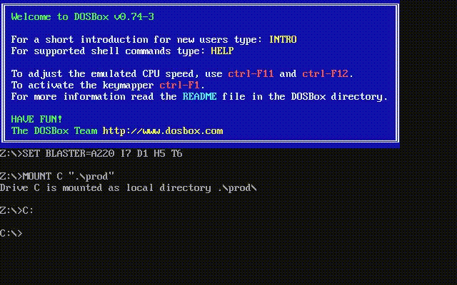

# COM and Binary Golf
After my fun time with [Dangerous Dave](https://github.com/yo-yo-yo-jbo/dangerous_dave) I've decided to look for more opportunities to play around with Real Mode assembly.  
It's just so happens that [Binary Golf Grand Prix](https://binary.golf) is happening!  
For those of you who are unfamiliar, Binary Golf Grand Prix is a competition to generate small files that do a specific task.  
This year (2023) the task is simple: self-copy to a file called `4` and either output or return `4`. You can do it in a shell script, Python etc.  
Obviously scripting would be easy, but I've decided to go with [COM](https://en.wikipedia.org/wiki/COM_file)!

## COM background
COM files are type of executable files used throughout various DOS operating systems, including `MS-DOS`. They do not have any headers and are just loaded to memory at address `ip=0x100`. Their code segment, data segment and stack segments all have the same value.  
These facts make COM files very attractive for minimalism, as we can literally write code immidiately with no headers and use the fact they're loaded to a predefined address. Obviously I intend to use interrupts extensively to get file operations done.

## Plan of action
My plan is simple - use software interrupts (mostly [DOS API](https://en.wikipedia.org/wiki/DOS_API) that usually revolves around `int 21h`) and minimize assembly encoding. Specifically:
1. Create a file called `4`.
2. Write the contents to the file. Since we already know where to copy from (`0x100`) and how much to copy (the file size) - this should be straightforward.
3. Write one character - `4`.
4. Teminrate program.

As usual, I plan to use [NASM](https://www.nasm.us) as my Assembler of choice.

There are some nice optimizations I discovered while doing this challenge:
1. It's better to use `xchg bx, ax` than `mov bx, ax` since it's encoded as a single byte... Of course, if you don't care about `ax`.
2. The program is loaded to `0x100` immidiately after a block called [Program Segment Prefix](https://en.wikipedia.org/wiki/Program_Segment_Prefix) (or PSP for short), which contains some useful information. Unfortunately, it wasn't useful to me.
3. It's better to use `int 0x20` than `int 0x21` to temrinate the program since you don't have to set any other registers.
4. The memory after the program is filled with zeros. Since I needed the NUL terminated string `4\x00` it saved me one byte.
5. There's very good documentation regarding initial register values when your program starts running ([here](http://www.fysnet.net/yourhelp.htm)). Specifically, I used the fact that `si` is `0x100` to my benefit, and the initial value of `0xFF` assigned to `CX` had to be dealt with.
6. Interrupts generally maintain register values. I use that for my benefit.
7. Since the stack initially contains a zero word, I can `ret` and that jumps to address `0` at the [PSP](https://en.wikipedia.org/wiki/Program_Segment_Prefix), which encodes `int 0x20`. This is fully reliable and takes one byte intead of 2!

## Code
Here's my code, followed by some explanations:

```assembly
;
; Make4.asm
;

; Constant - the file size
FILE_SIZE EQU (eof-$$)

; All COM programs start at 0x100
org 0x100

; BA 17 01
mov dx, filename		; Saves the filename to create in DX

; 91
; B4 5B
; CD 21
xchg ax, cx			; File attributes (sets to 0 as 0xFF is invalid - http://justsolve.archiveteam.org/wiki/DOS/Windows_file_attributes)
mov ah, 0x5B
int 0x21			; DOS interrupt 21,5B - Create File

; 93
; B1 18
; 89 F2
; B4 40
; CD 21
xchg bx, ax			; File handle (XCHG takes one less byte to encode)
mov cl, FILE_SIZE		; Bytes to write (CH is already 0)
mov dx, si			; Buffer to write (SI never changed and points to 0x100)
mov ah, 0x40
int 0x21			; DOS interrupt 21,40 - Write To File

; B8 34 0E
; CD 10
mov ax, 0x0E34			; Character + interrupt number
int 0x10			; BIOS interrupt 10,0E - Write character

; C3
ret				; DOS interrupt 20 - Terminate Program through PSP
	
; 34
filename: db '4'		; Maintains the filename (saves the NUL terminator since post-program chunk if full of zeros)
eof:
```

Let's examine it:
1. `FILE_SIZE` is just a constant, like `#define` in C, and lets me reuse that value later. It does not encode as any bytes on its own.
2. `org 0x100` is a directive that tells NASM to assume program is loaded at that address. It does not encode as any bytes.
3. `mov dx, msg` readies the `dx` register to save the filename to create. This is a costly instruction that takes 3 bytes!
4. I use `xchg ax, cx` which takes one byte (generally `xchg` takes 2 bytes but `ax` register encoding makes it 1 byte). Since the initial value of `cx` is `0xff` and since `cx` is used as the file attributes to create, I cannot use `0xff` (see [here](http://justsolve.archiveteam.org/wiki/DOS/Windows_file_attributes)).
5. I set `ah` to `0x5B` and call `int 21h`, which creates a file with the filename pointed by `dx` and the attributes in `cx`.
6. I use `xchg bx, ax` since I need the file handle in `bx` for the next interrupt. It's expected that the handle number is going to be `5`, but I wasn't able to use that fact to lower the number of encoded bytes - that `xchg` takes a single byte due to `ax` being present.
7. `cx` is set to the file size. Note I use the fact `ch` is already zero - therefore using `mov` on `cl` alone, which takes one less byte.
8. I need to set `dx` to `0x100`, and do so with `mov dx, si`, which takes one less byte. I use the fact `si` never got modified and it's initially `0x100`.
9. I assign `0x40` to `ah` and call the DOS interrupt `21h` again, which writes to the file handle given at `bx`. It writes the amount of bytes in `cx`, from the buffer pointed by `dx`.
10. I assign `ah` to `0x0e` and `al` to the character `4` in one go - by assigning `0x0E34` to `ax`. Then I call `int 10h` which is a [BIOS interrupt](https://en.wikipedia.org/wiki/BIOS_interrupt_call) that writes the character in `al` to the terminal.
12. I quit the program by calling `int 20h` but in a special way - since the initial stack has a zero, doing a `ret` instruction jumps to address `0`. Well, as I mentioned - that's where the [PSP](https://en.wikipedia.org/wiki/Program_Segment_Prefix) is, and it must start with the bytes `CD 20` which encode `int 20h` - saving one byte.
13. Note the data at the end encodes `4` for the filename without a NUL terminator - I use the fact that the program is loaded to an area full of zeros to save one extra byte.

The entire program takes `24` bytes - not a bad start!  
You can compile with the following command:

```shell
nasm -f bin -o MAKE4.COM make4.asm
```

## Exit codes
One thing I noticed is that I printed `4` but could easily just return `4`, which saves one instruction...  
Instead of printing `4` and calling `int 0x20`, I could just use DOS int21h, vector=`4C`:

```assembly
mov ax, 0x4C04			; Return value of 04 is in AL
int 0x21
```

The problem is that DOSBox seems to set `ERRORLEVEL` to either `1` or `0`, rather than actually using the return value.  
However, [DOSBox-X](https://dosbox-x.com/) accurately does this - we use `IF ERRORLEVEL` instructions to distinguish exit codes since `%ERRORLEVEL%` variable is not well defined:

```shell
MAKE4.COM
IF ERRORLEVEL 5 ECHO NO
IF ERRORLEVEL 4 ECHO YES
```

This should output `YES`.  
This gives us a total of `23` bytes!

```assembly
;
; Make4.asm
;

; Constant - the file size
FILE_SIZE EQU (eof-$$)

; All COM programs start at 0x100
org 0x100

;
; BA 16 01
mov dx, filename		; Saves the filename to create in DX

;
; 91
; B4 5B
; CD 21
xchg ax, cx			; File attributes (sets to 0 as 0xFF is invalid - http://justsolve.archiveteam.org/wiki/DOS/Windows_file_attributes)
mov ah, 0x5B
int 0x21			; DOS interrupt 21,5B - Create File

;
; 93
; B1 17
; 89 F2
; B4 40
; CD 21
xchg bx, ax			; File handle (XCHG takes one less byte to encode)
mov cl, FILE_SIZE		; Bytes to write (CH is already 0 due to previous XCHG instruction)
mov dx, si			; Buffer to write (SI never changed and points to 0x100 - http://www.fysnet.net/yourhelp.htm)
mov ah, 0x40
int 0x21			; DOS interrupt 21,40 - Write To File

;
; B8 04 4C
; CD 21
mov ax, 0x4C04			; Return value of 04 is in AL
int 0x21			; DOS interrupt 21,4C - Terminate Program

; 34
filename: db '4'		; Maintains the filename (saves the NUL terminator since post-program chunk if full of zeros)
eof:
```

## Failed ideas
- One more idea that I had (which wasn't successful) is to somehow save the repetition of `int 0x21` - we do it 3 times so it costs 6 bytes.  
One idea that I had was living off the land: in the [PSP](https://en.wikipedia.org/wiki/Program_Segment_Prefix) at offset `0x50` we see `Unix-like far call entry into DOS (always contains INT 21h + RETF)`. The `INT 21h` part fits us perfectly, but `RETF` is problematic. In fact, even if I could magically make it `C3` (normal `RET`) it'd still require at least `2` bytes each time to `CALL` (calling an address takes `3` bytes, calling a register takes `2` bytes).
- A similar idea was to reuse addresses we know such as `0:0` (the [Interrupt Vector Table](https://en.wikipedia.org/wiki/Interrupt_vector_table)). Again - too costly to use.
- I still had hopes that somehow I could magically call `INT 20h` and affect the return code. I examined the [DOSBox-X](https://dosbox-x.com) source code and it seems the handler for `INT 21h,4C` calls `DOS_Terminate` with the `DL` value as the exit code. This seems to be the only viable way to save the exit code.
- The DOS interrupt 21 with `AH=2` writes the character at `DL` as output, and it just so happens the initial `flags` is set to `2`, so the `lahf` insstruction (which takes a single byte) could be useful here. However, there is no gain here as we still need to call `INT 21h` (again) and then `ret`.
- I thought of writing directly to memory instead of outputting `4`. You can write a character to `0xB800:0` and it will "magically" appear on the screen due to [MMIO](https://en.wikipedia.org/wiki/Memory-mapped_I/O_and_port-mapped_I/O). Unfortunately, I was not able to encode the relevant instructions and gain anything. Also, I was not sure if this is counted as a true output because it does not really write to `STDOUT`, so it doesn't work if the caller redirects output (let's say, to a file).
- Using `INT 2Eh` seemed like a smart move - it gets commands to execute in `COMMAND.COM`! However, `COPY * 4` does not work well - apparently you have to run `COPY *.* 4` which ends up not saving a lot of bytes. Trying to print out `4` or returning an exit code of `4` ends up with more bytes. The minimum I got was `23` bytes.

## Fast Console Output
Looking at [Ralf Brown's Interrupt List](http://www.ctyme.com/hosting/index.htm) I discovered `INT 29h` - Fast Console Output. It will output the character in the `AL` register and *does not require setting any other register values*, which is great for my efforts to minimize the payload length. This means we can use the `RET` idea to return to PSP address `0` after printing. This is still `23` bytes, but at least runs on DOSBox:

```assembly
;
; Make4.asm
;

; Constant - the file size
FILE_SIZE EQU (eof-$$)

; All COM programs start at 0x100
org 0x100

;
; BA 16 01
mov dx, filename		; Saves the filename to create in DX

;
; 91
; B4 5B
; CD 21
xchg ax, cx			; File attributes (sets to 0 as 0xFF is invalid - http://justsolve.archiveteam.org/wiki/DOS/Windows_file_attributes)
mov ah, 0x5B
int 0x21			; DOS interrupt 21,5B - Create File

;
; 93
; B1 17
; 89 F2
; B4 40
; CD 21
xchg bx, ax			; File handle (XCHG takes one less byte to encode)
mov cl, FILE_SIZE		; Bytes to write (CH is already 0 due to previous XCHG instruction)
mov dx, si			; Buffer to write (SI never changed and points to 0x100 - http://www.fysnet.net/yourhelp.htm)
mov ah, 0x40
int 0x21			; DOS interrupt 21,40 - Write To File

; B0 34
; CD 29
mov al, '4'			; Character to write in AL
int 0x29			; DOS interrupt 29 - Fast Console Output

; C3
ret				; Hack - returns to address 0 which has the PSP and effectively runs DOS interrupt 20 - Terminate Program

; 34
filename: db '4'		; Maintains the filename (saves the NUL terminator since post-program chunk if full of zeros)
eof:
```

Can we do better? Note we encode the character `4` twice! Well, I was able to get to `22` bytes with the following changes:
1. Replace the `mov dx, si` with `xchg dx, si`. This still encodes as `2` bytes, but now makes `si` point to the last byte of the file (where the character `4` is). Of course, `dx` still gets the `0x100` value from `si`, which is the desired effect.
2. Replace `mov al, '4'` with `lodsb`! That instruction takes `1` byte only and assigns the value of `ds:[si]` to `al`.

Here is the new code:

```assembly
;
; Make4.asm
;

; Constant - the file size
FILE_SIZE EQU (eof-$$)

; All COM programs start at 0x100
org 0x100

;
; BA 15 01
mov dx, filename		; Saves the filename to create in DX

;
; 91
; B4 5B
; CD 21
xchg ax, cx			; File attributes (sets to 0 as 0xFF is invalid - http://justsolve.archiveteam.org/wiki/DOS/Windows_file_attributes)
mov ah, 0x5B
int 0x21			; DOS interrupt 21,5B - Create File

;
; 93
; B1 16
; 87 D6
; B4 40
; CD 21
xchg bx, ax			; File handle (XCHG takes one less byte to encode)
mov cl, FILE_SIZE		; Bytes to write (CH is already 0 due to previous XCHG instruction)
xchg dx, si			; Exchange DX and SI (SI never changed and points to 0x100 - http://www.fysnet.net/yourhelp.htm)
mov ah, 0x40
int 0x21			; DOS interrupt 21,40 - Write To File

; AC
; CD 29
lodsb				; Load the last byte of the file in AL - was set when previously exchanging DX and SI
int 0x29			; DOS interrupt 29 - Fast Console Output

; C3
ret				; Hack - returns to address 0 which has the PSP and effectively runs DOS interrupt 20 - Terminate Program

; 34
filename: db '4'		; Maintains the filename (saves the NUL terminator since post-program chunk if full of zeros)
eof:
```

This is how it looks like this when running:



The file's contents are already captured in the code here, but here are the contents for good measure:
```
ba 15 01 91 b4 5b cd 21 93 b1 16 87 d6 b4 40 cd 21 ac cd 29 c3 34
```

## More Binary Golf
Besides COM, there were other Binary Golf targets, including:

### Shell script
This might look naive, but here's what I got:

```shell
#!
cp * 4
echo 4
```

This takes `16` bytes to code. The interesting part here is the missing `#!` ([Shebang](https://en.wikipedia.org/wiki/Shebang_(Unix))).  
Another idea here is to use `*` to copy - this assumes my script runs alone in the directory.  
Also, `vim` and other editors usually finish with a linebreak (after `echo 4`) so I made sure to remove it.

## Conclusions
This has been a fun challenge! We have covered a lot of cool tricks to minimize our payload, including:
1. The structure of COM files and using some interesting [initial register values](http://www.fysnet.net/yourhelp.htm).
2. Using the [PSP](https://en.wikipedia.org/wiki/Program_Segment_Prefix) to return to address 0 and calling `INT 20h`.
3. Using `xchg` instead of `mov` can cost one less byte if `ax` is involved.
4. Using `lodsb` to read a byte into `al`.
5. Looking for interesting interrupts at [Ralf Brown's Interrupt List](https://www.ctyme.com/rbrown.htm).
6. Using uninitialized (yet effectively zero'd) memory to our advantage.

Thanks for sticking around!

Jonathan Bar Or
